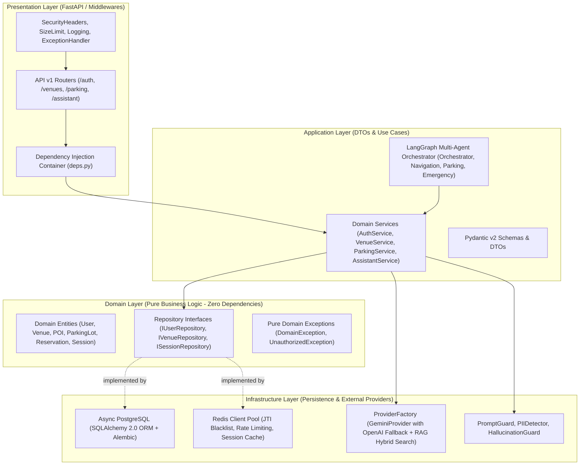
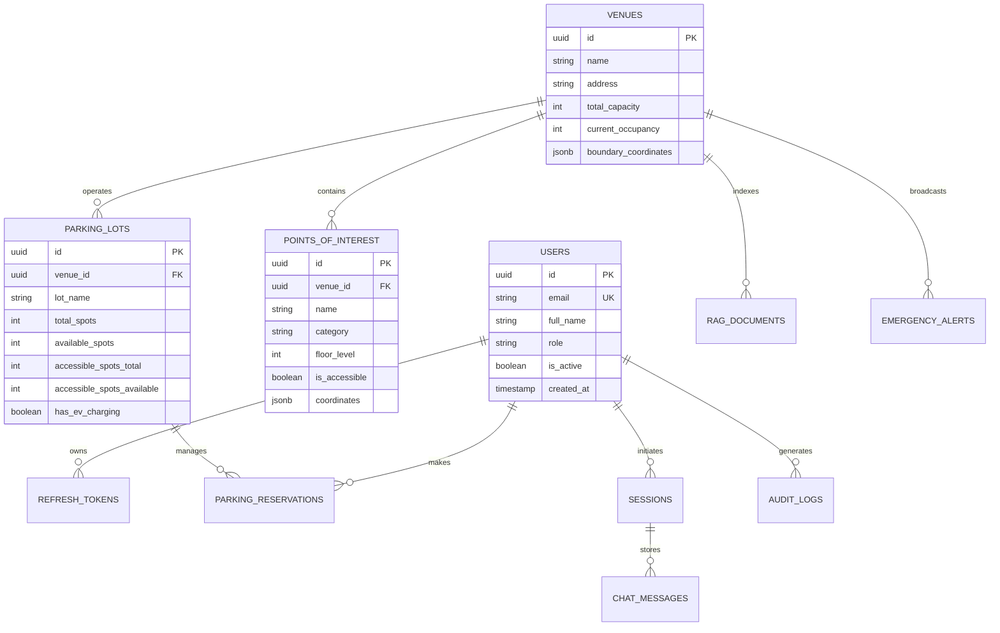
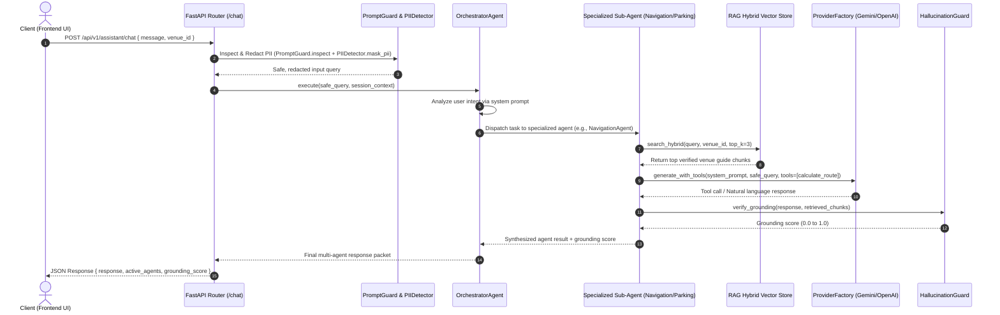

# System Architecture & Technical Specifications

The **Cultural & Venue Smart Copilot Platform** is built from the ground up to support high-scale, real-time indoor navigation and operations management for museums, galleries, and exhibition spaces. It strictly implements **Clean Architecture**, **Domain-Driven Design (DDD)**, and **SOLID** principles.

---

## 1. Clean Architecture Layer Separation

---

## 2. Entity-Relationship (ER) Diagram

---

## 3. LangGraph Multi-Agent Interaction Sequence

